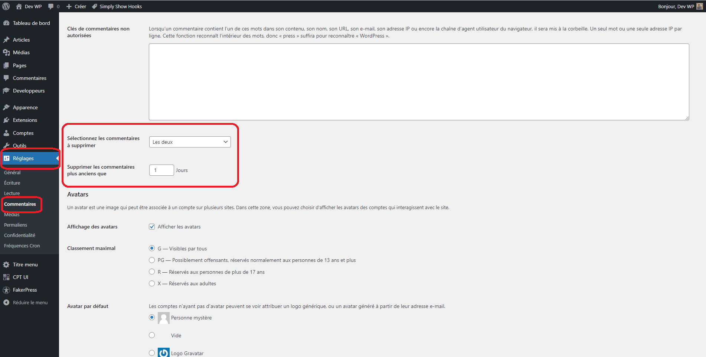

# Delete Comments on a Schedule

Ce plugin vous permet de nettoyer facilement votre base de données en supprimant les spams et les commentaires modérés qui encombrent votre site.

Avec Delete Comments on a Schedule, vous pouvez facilement maintenir votre site propre et organisé en supprimant automatiquement les commentaires indésirables.

Ce plugin vous permet de sélectionner les types de commentaires à supprimer, soit les commentaires modérés, les commentaires spam ou les deux, ainsi que de définir un nombre de jours pour lesquels les commentaires plus anciens seront automatiquement supprimés.

Cette fonctionnalité est automatisée grâce à une tâche CRON programmée quotidiennement. 
Grâce à Delete Comments on a Schedule, vous pouvez vous concentrer sur ce qui est important, le contenu de votre site, sans vous soucier de la gestion des commentaires indésirables.

# Installation 
À PARTIR DE WORDPRESS

1. Allez dans 'Extensions > Ajouter'.
2. Recherchez 'Ajouter une colonne d'ID'.
3. Activez 'Delete Comments on a Schedule' pour WordPress à partir du menu 'Extensions' de WordPress.
4. Allez dans Réglages puis Commentaires pour planifier vos suppressions.

MANUELLEMENT

1. Téléchargez le dossier delete-comments-on-a-schedule/ dans le répertoire /wp-content/plugins/.
2. Activez le plugin dans le menu "Extensions" de WordPress.
3. Allez dans Réglages puis Commentaires pour planifier vos suppressions.

# Utilisation

Allez dans le Back Office, Réglages puis Commentaires.

Séléctionnnez vos commentaires à supprimer, puis sauvegarder et laisser le plugin faire le reste à votre place.

# Screenshots

